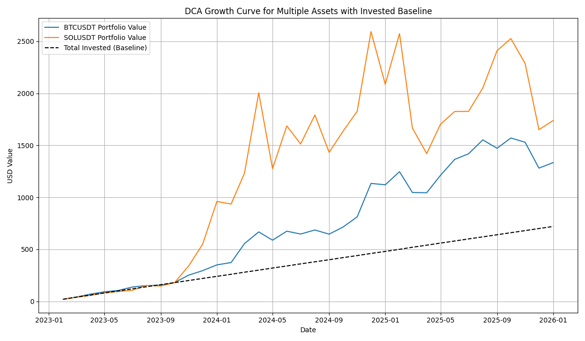

# CryptoDCA

**CryptoDCA** is a Python tool for performing **Dollar-Cost Averaging (DCA)** on cryptocurrencies using Binance historical data.  
It allows you to calculate portfolio growth, track accumulated tokens, and visualize the value of your investments over time.

This utility supports **multiple symbols at once** and generates a chart showing the **portfolio value vs total invested baseline**.

---

## Features

- Multi-symbol support (e.g., BTCUSDT, SOLUSDT, LUNCUSDT)
- Fetches **monthly historical data** from Binance
- Calculates:
  - Tokens acquired per month
  - Total invested
  - Current portfolio value
  - Net profit/loss
  - ROI (%)
- Generates a **DCA growth curve chart** with a baseline for total invested
- Command-line interface with interactive user input

---

## Requirements

- Python 3.9+
- [pandas](https://pandas.pydata.org/)
- [matplotlib](https://matplotlib.org/)
- [python-binance](https://python-binance.readthedocs.io/)

Install dependencies via pip:

```bash
pip install pandas matplotlib python-binance
```

## Usage

1. Run the script:
```bash
python crypto_dca.py
```

2. Enter the required inputs when prompted:

- Trading pairs (comma-separated, e.g., `BTCUSDT, SOLUSDT`)
- Start date (e.g., `1 Jan, 2023`)
- Monthly investment amount per asset (e.g., `20`)

3. The script will output:

- Transactions per month with tokens purchased
- Total invested and accumulated tokens
- Current portfolio value and ROI
- A plot showing:
  - Portfolio value for each symbol over time
  - Dashed baseline for total invested
 
## Example Output
```yml
Fetching historical data for BTCUSDT...
2023-01-31 - Bought 0.005 BTC @ $40,000
2023-02-28 - Bought 0.0048 BTC @ $41,500
...
===== BTCUSDT =====
Total invested:          $240
Total tokens acquired:    0.0284
Current price:           $45,000
Portfolio value today:   $1,278
Net profit/loss:         $1,038
ROI:                      432.5%
```


